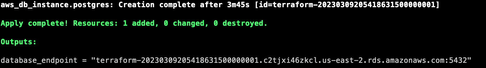
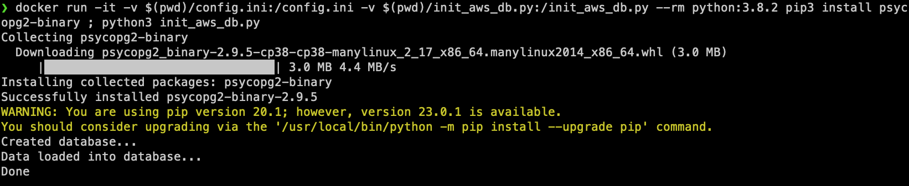
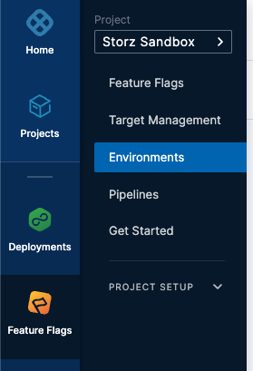
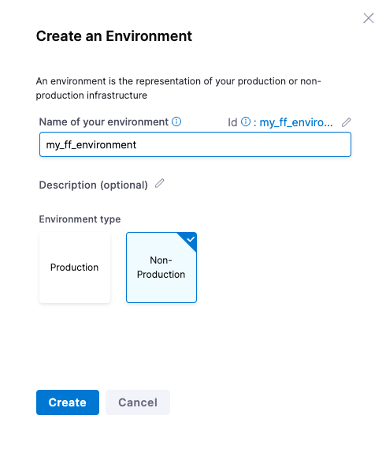
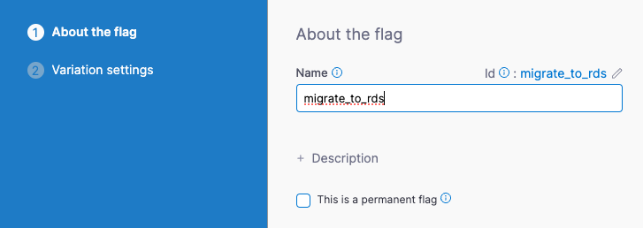

# Setup

## Create Cloud Database

### Warning
_AWS Costs Money_

### Environment variables 
Prior to running Terraform, create necessary environment variables

```
export DATABASE_PASSWORD="harnessisbest"
export SECURITY_GROUP="sg-abc123"
export SUBNET_GROUP="default-vpc-abc123"
export AWS_ACCESS_KEY_ID=""
export AWS_SECRET_ACCESS_KEY=""
export AWS_SESSION_TOKEN=""
```

### Run Terraform

_Disclaimer: Everyone's environment is different, you may need to tweak the Terraform to comply with your governance and/or security rules._
```
 terraform init
 
 terraform apply -var "database_password=$DATABASE_PASSWORD"  -var "security_group=$SECURITY_GROUP" -var "subnet_group=$SUBNET_GROUP"
```

### Load Data
Once your DB is created by Terraform you will receive the endpoint information.

Rename `config.ini.sample` to `config.ini` and modify the values for `host`, `port`, `user`, and `password` as appropriate for your environment.

Run the Python loader script in a docker container. This can be done locally, but that approach is not recommended.

```commandline
docker run -it -v $(pwd)/config.ini:/config.ini -v $(pwd)/init_aws_db.py:/init_aws_db.py --rm python:3.8.2 pip3 install psycopg2-binary ; python3 init_aws_db.py
```


## Configure Environment & Feature Flag

_This assumes you already have a Harness account and have a minimum of the free license enabled for Feature Flags_

### Environment Configuration

In the UI navigate to `Feature Flags` on the left-hand panel, and click into `Environments` on the submenu.



Click on `+ New Environment` and create an environment called `my_ff_environment`. Leave the rest of the default values
and click create



Click `+ New SDK Key` and create a `server` key called `my_key`, storing the value presented after creation in your 
`config.ini` file under the section `feature_flags` as the value of `key`.

### Feature Flag Creation

In the UI navigate to `Feature Flags` on the left-hand panel, and click into `Feature Flags` on the submenu.
 
Click `+ New Feature Flag`, and select `Boolean` on the overlay that appears.

Enter the name `migrate_to_rds` and click `Next`.



On the following page leave all the default values as is and click `Save and Close`.


## Build Application

### Build Image with Docker

```commandline
docker build -t harnessff:1 .
```
